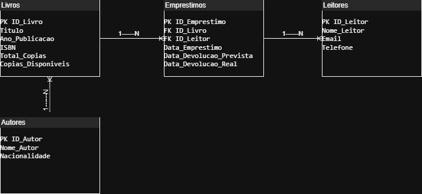

# Projeto de Modelo de Dados: Sistema de Gerenciamento de Biblioteca

## Visão Geral do Projeto

Este projeto apresenta um modelo de dados relacional para um **Sistema de Gerenciamento de Biblioteca**. O objetivo principal é demonstrar como a estruturação eficiente de dados pode suportar funcionalidades essenciais de uma biblioteca, com foco na capacidade de **registro e acompanhamento de empréstimos e devoluções de livros**.

O modelo de dados é a base para a construção de qualquer sistema robusto, garantindo a integridade, organização e acessibilidade das informações.

## Nova Funcionalidade Destacada: Gerenciamento de Empréstimos e Devoluções

Uma das principais funcionalidades habilitadas por este modelo de dados é o **controle detalhado de empréstimos e devoluções**. Através da tabela `Emprestimos` e seus relacionamentos, é possível:

* Registrar qual `Livro` foi emprestado.
* Identificar qual `Leitor` realizou o empréstimo.
* Monitorar as datas de empréstimo, previsão e efetiva devolução.
* Facilitar consultas sobre livros emprestados, livros atrasados, histórico de empréstimos por leitor, etc.

## Estrutura do Modelo de Dados

O modelo de dados é composto pelas seguintes entidades (tabelas) e seus relacionamentos:

### Entidades (Tabelas)

* **`Livros`**: Armazena informações detalhadas sobre cada livro disponível na biblioteca, incluindo seu ID único (Chave Primária), título, ano de publicação, ISBN, número total de cópias e cópias disponíveis, e a ligação com seu autor.
    * **PK**: `ID_Livro`
    * **FK**: `ID_Autor`
    * **Atributos**: `Titulo`, `Ano_Publicacao`, `ISBN`, `Total_Copias`, `Copias_Disponiveis`

* **`Autores`**: Contém os dados dos autores dos livros.
    * **PK**: `ID_Autor`
    * **Atributos**: `Nome_Autor`, `Nacionalidade`

* **`Leitores`**: Registra as informações dos usuários da biblioteca que podem realizar empréstimos.
    * **PK**: `ID_Leitor`
    * **Atributos**: `Nome_Leitor`, `Email`, `Telefone`

* **`Emprestimos`**: A tabela central para a funcionalidade de empréstimos, registrando cada transação de empréstimo e devolução.
    * **PK**: `ID_Emprestimo`
    * **FKs**: `ID_Livro`, `ID_Leitor`
    * **Atributos**: `Data_Emprestimo`, `Data_Devolucao_Prevista`, `Data_Devolucao_Real`

### Relacionamentos

O diagrama ER (Entity-Relationship Diagram) abaixo ilustra como essas entidades se conectam:

* **Autor (1:N) Livros**: Um autor pode escrever muitos livros.
* **Livro (1:N) Empréstimos**: Um livro pode ser emprestado muitas vezes.
* **Leitor (1:N) Empréstimos**: Um leitor pode realizar muitos empréstimos.

*Clique na imagem para visualizá-la em tamanho maior.*

## Artefatos do Projeto

* **Diagrama ER (arquivo editável)**: `Biblioteca.drawio`
* **Planilhas de Dados de Exemplo**:
    * `BD BIBLIOTECA - Autores.csv`
    * `BD BIBLIOTECA - Leitores.csv`
    * `BD BIBLIOTECA - Livros.csv`
    * `BD BIBLIOTECA - Emprestimo.csv`

 * **Dashboard Power BI**:
    * Arquivo do Power BI Desktop: [`Dashboard_Empréstimos_Biblioteca.pbix`](Dashboard_Empréstimos_Biblioteca.pbix)
        * *(Para visualizar o dashboard, baixe este arquivo e abra-o com o Power BI Desktop.)*

* **Board de Projeto (Trello)**: https://trello.com/invite/b/6845e362c677d353127c0a88/ATTI79d906a663e172d52f852bdbf154f90c1EFB2072/andre-henrique-vasconcelos-prova-oficial-board

## Como Acessar / Visualizar

* **Diagrama ER**: O arquivo `Biblioteca.drawio.png` pode ser visualizado diretamente no GitHub. Para editar, baixe o arquivo `.drawio` e abra-o no [draw.io (diagrams.net)](https://app.diagrams.net/).
* **Planilhas de Dados**: Podem ser visualizadas diretamente no GitHub ou baixadas e abertas em qualquer software de planilhas (Excel, Google Sheets).
* **Dashboard Power BI**: Baixe o arquivo `.pbix` e abra-o com o [Power BI Desktop](https://powerbi.microsoft.com/desktop/).
